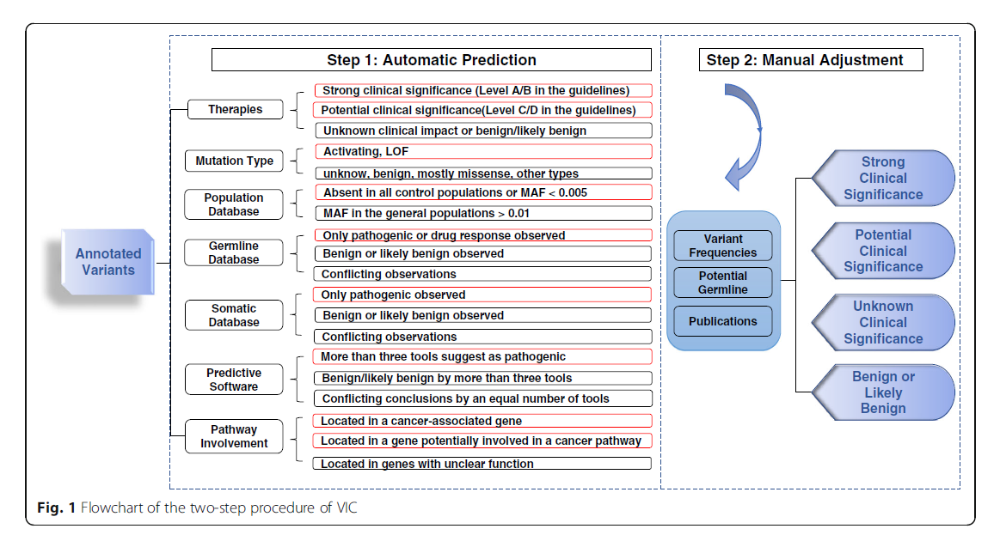
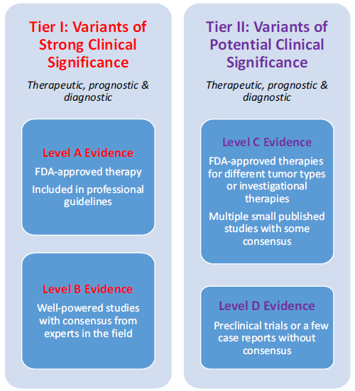

虽然**肿瘤突变指南**早在2017年1月就由AMP，ASCO和CAP联名发布，但过去的三年里，实际上采用次标准的公司并不多，只有最近几个月才采取此标准的呼声才逐渐强烈。

抛开大家的采用的意愿不谈，个人认为此标准难以统一的原因是，指南中存在很多模糊、甚至相冲突的概念，很容易造成大家的困惑。例如指南中提出的10个判断标准，并没有说明具体的划分界限，以及各个标准所占的比重为多少。这样在实际操作过程中，就很容易会产生分歧。

而前两日我忽然发现王凯团队开发的一款名为 VIC (Variant Interpretation for Cancer) 的肿瘤突变分类软件，在指南的基础上融合了 Global Alliance for Genomics and Health (GA4GH) 组织中提及的肿瘤评判资料 ，对上述提到的模糊区域进行明确的定义及填充，能很大程度上实现突变分类自动化这一过程。

## 分类标准

VIC将指南中提及的 10 大标准按是否可自动化，分为两类，其中可自动打分的标准有 7 个，剩余 3 个标准需要人工审核，当然也提前人工构建好，用参数加入软件让其自动判断。详情如下图：

 

### 1. Therapies (clinical impacts)

这实际上指的就是指南中对于生物标志物的四级分类（如下图）

A) FDA 及 PG (professional guideline) 如 NCCN ；

B) 达成专家共识、或者多组小型研究；

C) FDA 和 PG 中对于不同癌肿的研究，或者是进行临床试验的研究；

D) 临床前研究中的标志物，或者伴随性标志物

对此，VIC 收集、整合了 [PMKB](https://pmkb.weill.cornell.edu/) 和 [CGI](https://www.cancergenomeinterpreter.org/home) 中的数据，并融入 VIC 自带数据库中。对于属于 A/B 等级的生物标志物 (CGI中列为 guideline 或者 approved，并且癌肿吻合 )，突变将会被认为具有强临床意义，并得分2分；对于 C/D 类生物标志物 (CGI中列为 preclinical、 case report 亦或者 trials，或者收录在PMKB之中)，突变会被认为具有潜在临床意义，得分1分；剩余接得0分。

同时，VIC 收录了 CIViC数据库中的证据总结，可对突变进行提示

### 2. Mutation Type

突变种类，例如 likely loss-of-function (LoF) 功能缺失突变、非同义突变、CNV、融合等。VIC 预先将 ClinVar 以及 ExAC 中 null variants（frameshift, splice, stop-gain, stop-loss）突变定义为 LoF 突变。实际打分过程中，将 activiting 以及 LoF 突变评分1分，其余的非同义突变、未知突变类型等皆为0分

### 3. Variant Frequency

突变频率 VAF， 可用于推测该突变是否来自于胚系。对于SNP来说，胚系突变的VAF大约在50%或100%附近，但对于某些突变如 indel，它们会造成对于正常序列的偏好性的捕获或者扩增，所以导致 < 50% 的VAF。

如检测过程没有使用配对的正常组织，这里需要实验室**自己设定**一个明确界限，用于区分胚系和体系突变。由于这个标准跟测序流程有很大关系，不同实验室的界限往往相差甚远，因此VIC没有制定明确的标准。当然，用户可以通过参数来进行区分

### 4. Potential Germline

此标准跟标准三类似，目的是为判断是否可能为胚系突变。用户可自己通过软件预测，或者配对样本来进行判断

### 5. Population Frequency

这是最常见的过滤标准，即在各人群频率数据库中寻找该突变，若突变存在并且MAF > 0.01 则被视为多态性/良性突变，可直接过滤

VIC 使用了四大人群数据库：

- 1000 Genome Project (1000g); 

- Exome Aggregation Consortium (ExAC); 

- NHLBI GO Exome Sequencing Project (ESP6500); 

- Genome Aggregation Database (GnomAD 2.1.1)

### 6. Germline Mutation Database

对于胚系突变数据库，VIC仅使用 ClinVar 来进行注释，即 CLINSIG 中仅标记为 pathogenic  的突变得分2分；仅标记为 benign 或者 likely benign 的突变得分1分；剩余的情况如冲突、意义未名皆得分0分

### 7. Somatic Mutation Database

这里指的其实是癌症突变数据库，如TCGA、ICGC等，这类数据库记载了在不同癌症中发现的体系突变。

对此，VIC参考了 COSMIC 以及 ICGC 数据库，若突变同时在两个数据库中出现，则打分2分；若在一个数据库中出现，则评分1分；若不出现，则为0分

需要注意的是，由于 COSMIC 需要购买才能够获取，我们使用的 v70 版本已是2014年发布的，至今时间已经太久，可能有很多新的突变没被记录。因此此处我打算更换为 TCGA 数据库，原理上并无区别，当然此处还有待商议。

### 8. Predictive Software

这里和 ACMG 的遗传指南判读标准一致，但值得注意的是，由于绝大数的软件都是基于胚系突变而非体系突变进行的，因此蛋白质上的变化不一定会直接致成致病性的后果。

VIC融合了七种预测软件的结果：

- MetaSVM; 
- SIFT;
- Polyphen2;
- MetaLR;
- FATHMM;
- MutationTaster;
- GERP++

若三者以上预测结果为致病，则打分2分；若致病、良性结果均出现，则打分1分；若三者以上预测结果为良性，则打分0分

### 9. Pathway Involvement

关键通路中的基因，若发生的非同义突变，往往会对癌症的产生、进展产生影响，因此了解基因是否位于可用药的通路之中非常重要。

VIC 整合了两大通路数据库：Cancer Gene Census ([CGC](https://cancer.sanger.ac.uk/
census)) 以及 Kyoto Encyclopedia of Genes and Genomes ([KEGG](https://cancer.sanger.ac.uk/
census))，将位于关键癌症通路上的基因存于`cancer_genes.list` 文件中，而癌症相关通路的基因存于 `cancer_pathways.list`

对于突变处于 cancer_genes 中的基因之中，得分2分；若突变处于 cancer_pathway 之中，则得分1分；剩余突变均0分

当然，VIC承认自己的数据可能不全，因此允许用户添加自定义基因

### 10. Publications

很多研究都发布了关于突变功能、临床影响的文章，但由于这些文献使用不同的实验方法、分析流程，VIC 并没有自动去完成这一步的工作。不过VIC整合了civic数据库中出现的文献，可用于参考

用户可自行整理文献，并通过参数传递给VIC进行评分

下图为VIC 评分标准：

  

## 结束语

需加在用药注释之后，需要注意的是，为以防注释的信息与用药注释产生冲突，我们需要在确保可用药突变不删除的情况下，删除良性突变。另外由于 VIC 并没有单独的找出MNP人群数据库，我们需要另外将其加入，以删除良性MNP

由于之前人工进行等级分类时，将很多 ClinVar 中标记为良性的突变，以及全部的同义突变直接当作良性删除，而指南中则将其作为十大标准的一项进行处理，因此可预见的是，使用 VIC 之后将会出现很多原本被判为良性，而现在被判为 VUS 的突变

